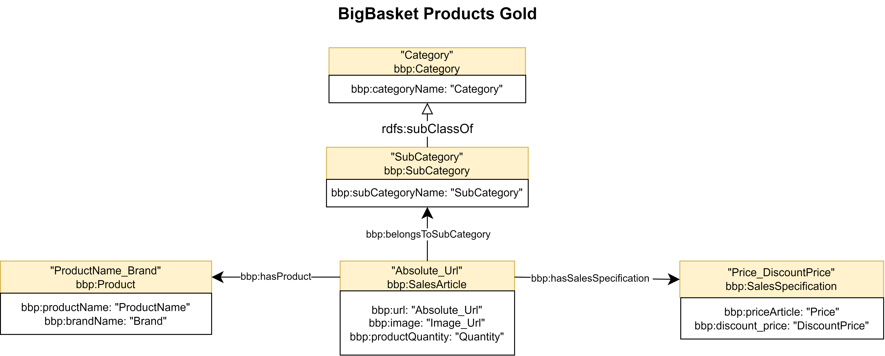
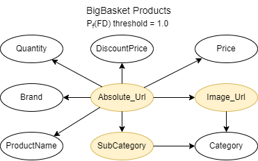
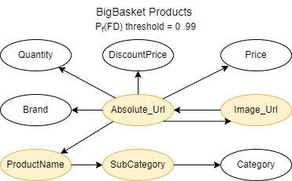
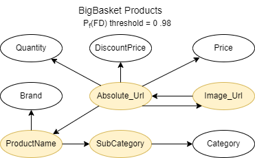
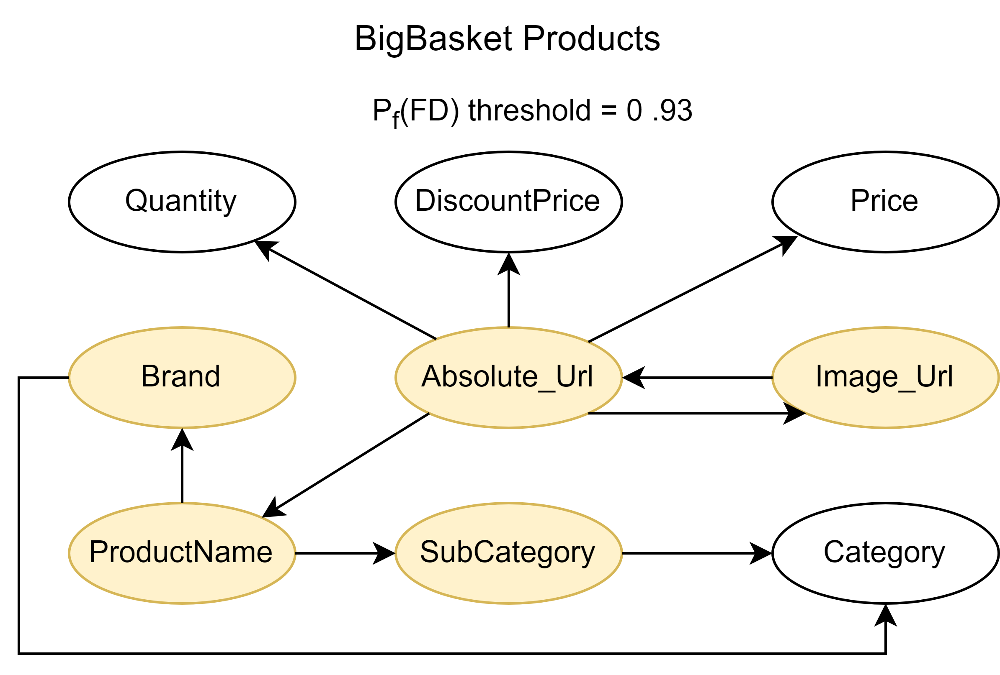
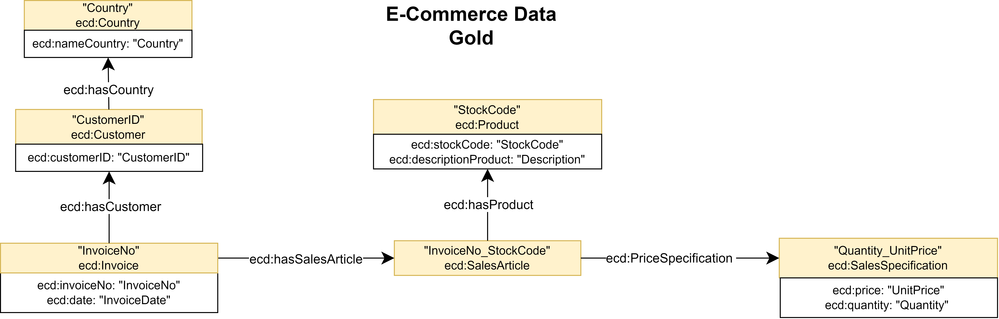
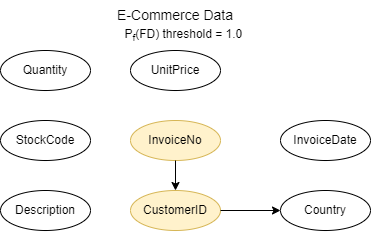
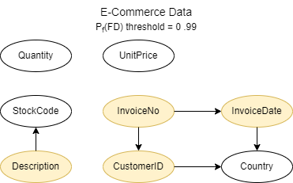
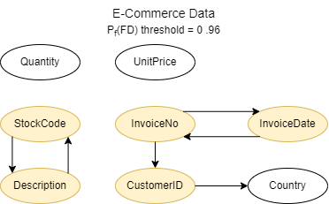
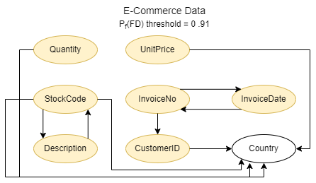

# Inferring Semantic Schemas from Functional Probabilities

## BigBasket Products

### Dataset BigBasket

[processed_BigBasket.csv (2.57 MB)](./Data/BigBasketProducts/processed_BigBasket.csv)

* Initial structure: 8208 rows x 9 columns
* Final structure: 8208 rows x 9 columns
* Processing:
  * Remove duplicate rows
  * Remove rows with all null values

  |Columns Name | Datatypes | NoNull | Unique |
  |--|--|--|--|
  |ProductName | string | 8208 | 6769 |
  | Brand | string | 8208 | 842 |
  | Price | float | 8208 | 1043 |
  | DiscountPrice | float | 8208 | 2180 |
  | Image\_Url | anyURI | 8208 | 8202 |
  | Quantity | string | 8208 | 781 |
  | Category | string | 8208 | 11 |
  | SubCategory | string | 8208 | 334 |
  | Absolute\_Url | anyURI | 8208 | 8208 |

### Results BigBasket

#### Threshold = 1.0 BigBasket Results

* [BigBasket schema 1.0](./Data/BigBasketProducts/Results/processed_BigBasket_1.0_0_schema.csv)
* [BigBasket probability 1.0](./Data/BigBasketProducts/Results/processed_BigBasket_1.0_0_fd_prob.csv)
* [BigBasket quality 1.0](./Data/BigBasketProducts/Results/processed_BigBasket_1.0_0_fd_ratios.csv)

#### Threshold = 0.99 BigBasket Results

* [BigBasket schema 0.99](./Data/BigBasketProducts/Results/processed_BigBasket_0.99_0_schema.csv)
* [BigBasket probability 0.99](./Data/BigBasketProducts/Results/processed_BigBasket_0.99_0_fd_prob.csv)
* [BigBasket quality 0.99](./Data/BigBasketProducts/Results/processed_BigBasket_0.99_0_fd_ratios.csv)

#### Threshold = 0.98 BigBasket Results

* [BigBasket schema 0.98](./Data/BigBasketProducts/Results/processed_BigBasket_0.98_0_schema.csv)
* [BigBasket probability 0.98](./Data/BigBasketProducts/Results/processed_BigBasket_0.98_0_fd_prob.csv)
* [BigBasket quality 0.98](./Data/BigBasketProducts/Results/processed_BigBasket_0.98_0_fd_ratios.csv)

#### Threshold = 0.93 BigBasket Results

* [BigBasket schema 0.93](./Data/BigBasketProducts/Results/processed_BigBasket_0.93_0_schema.csv)
* [BigBasket probability 0.93](./Data/BigBasketProducts/Results/processed_BigBasket_0.93_0_fd_prob.csv)
* [BigBasket quality 0.93](./Data/BigBasketProducts/Results/processed_BigBasket_0.93_0_fd_ratios.csv)

## Ecommerce Data

### Dataset Ecommerce

[processed_data.csv (43.1 MB)](./Data/EcommerceData/processed_data.csv)

* Initial structure: 541909 rows x 8 columns
* Final structure: 530652 rows x 8 columns
* Processing:
  * Remove duplicate rows
  * Remove rows with all null values
  * Remove rows starting with '"'

|Columns Name | Datatypes | NoNull | Unique |
|--|--|--|--|
| InvoiceNo | string | 530652 | 25858 |
| StockCode | string | 530652 | 3999 |
| Description | string | 529198 | 4113 |
| Quantity | integer | 530652 | 709 |
| InvoiceDate | dataTime | 530652 | 23225 |
| UnitPrice | float | 530652 | 1628 |
| CustomerID | integer | 398005 | 4370 |
| Country | string | 530652 | 38 |

### Results Ecommerce

#### Threshold = 1.0 Ecommerce Results

* [Ecommerce schema 1.0](./Data/EcommerceData/Results/processed_data_1.0_0_schema.csv)
* [Ecommerce probability 1.0](./Data/EcommerceData/Results/processed_data_1.0_0_fd_prob.csv)
* [Ecommerce quality 1.0](./Data/EcommerceData/Results/processed_data_1.0_0_fd_ratios.csv)

#### Threshold = 0.99 Ecommerce Results

* [Ecommerce schema 0.99](./Data/EcommerceData/Results/processed_data_0.99_0_schema.csv)
* [Ecommerce probability 0.99](./Data/EcommerceData/Results/processed_data_0.99_0_fd_prob.csv)
* [Ecommerce quality 0.99](./Data/EcommerceData/Results/processed_data_0.99_0_fd_ratios.csv)

#### Threshold = 0.96 Ecommerce Results

* [Ecommerce schema 0.96](./Data/EcommerceData/Results/processed_data_0.96_0_schema.csv)
* [Ecommerce probability 0.96](./Data/EcommerceData/Results/processed_data_0.96_0_fd_prob.csv)
* [Ecommerce quality 0.96](./Data/EcommerceData/Results/processed_data_0.96_0_fd_ratios.csv)

#### Threshold = 0.91 Ecommerce Results

* [Ecommerce schema 0.91](./Data/EcommerceData/Results/processed_data_0.91_0_schema.csv)
* [Ecommerce probability 0.91](./Data/EcommerceData/Results/processed_data_0.91_0_fd_prob.csv)
* [Ecommerce quality 0.91](./Data/EcommerceData/Results/processed_data_0.91_0_fd_ratios.csv)

## Evaluation Metrics

Given:

* $G$: the set of gold-standard axioms,
* $P$: the set of predicted axioms,
* An axiom $m = (C, R, O)$, where $C$ is a class (subject), $R$ a property (predicate), and $O$ either a class (object property) or a datatype (attribute).

## Weighted Precision, Recall and F1-score

We define a similarity function $\text{sim}(p,g) \in \\{0,0.5,1\\}$ between a predicted axiom $p \in P$ and a gold axiom $g \in G$:

$$
\text{sim}(p,g) =
\begin{cases}
1.0 & \text{if } (C_p = C_g) \wedge (R_p = R_g) \wedge (O_p = O_g) \\
0.5 & \text{if } (C_p = C_g) \wedge (O_p = O_g) \wedge (R_p \neq R_g) \\
0.0 & \text{otherwise}
\end{cases}
$$

Weighted precision and recall are:

$$
\text{Precision}_w = \frac{1}{|P|} \sum_{p \in P} \max_{g \in G} \text{sim}(p,g)
$$

$$
\text{Recall}_w = \frac{1}{|G|} \sum_{g \in G} \max_{p \in P} \text{sim}(g,p)
$$

Weighted F1 is:

$$
F1_w = \frac{2 \cdot \text{Precision}_w \cdot \text{Recall}_w}{\text{Precision}_w + \text{Recall}_w}
$$

---

## Coverage with Penalty for Extra Predictions

$$
\text{Coverage}_{class} = \frac{|Classes_{covered}|}{|Classes_{Gold}| + |Classes_{Predicted}^{unique}|}
$$

$$
\text{Coverage}_{rel} = \frac{|Relations_{covered}|}{|Relations_{Gold}| + |Relations_{Predicted}^{unique}|}
$$

$$
\text{Coverage}_{dt} = \frac{|DatatypeProperties_{covered}|}{|DatatypeProperties_{Gold}| + |DatatypeProperties_{Predicted}^{unique}|}
$$

where:

* $Classes_{covered}$ = gold classes correctly matched by predictions
* $Relations_{covered}$ = gold object properties correctly matched (included _subClassOf_)
* $DatatypeProperties_{covered}$ = gold datatype properties correctly matched,
* $Predicted^{unique}$ = elements predicted but not in the gold standard.

These metrics extend the standard binary evaluation by (i) rewarding partial matches between subject–object pairs with different predicates, and (ii) penalizing systems that introduce non-existing classes or properties. They can be reported in addition to standard precision, recall and F1 to provide a more fine-grained evaluation.

### Metrics BigBasket

#### Gold Standard BigBasket

* 13 axioms (5 classes; 1 subClassOf; 3 relation properties; 9 datatype properties)
  
|Class|Property|Object|
|-----|---------|------|
|Category|categoryName|Category|
|SubCategory|subCategoryName|SubCategory|
|SubCategory|**subClassOf**|Category|
|Product(ProductName)|productName|ProductName|
|Product(ProductName)|brandName|Brand|
|SalesSpecification(Price_DiscountPrice)|priceArticle|Price|
|SalesSpecification(Price_DiscountPrice)|DiscountPrice|DiscountPrice|
|SalesArticle(Absolute_url)|hasUrl|Absolute_url|
|SalesArticle(Absolute_url)|hasImageUrl|Image_url|
|SalesArticle(Absolute_url)|hasProductQuantity|Quantity|
|SalesArticle(Absolute_url)|**hasProduct**|Product|
|SalesArticle(Absolute_url)|**belongsToSubCategory**|SubCategory|
|SalesArticle(Absolute_url)|**hasSalesSpecification**|SalesSpecification|

#### Threshold = 1.0 BigBasket Metrics

* 12 axioms (3 classes; 0 subClassOf; 2 relation properties; 9 datatype properties)
* [BigBasket metrics 1.0](./Metrics/BigBasket/threshold_1.md)

* $Precision = 5.5 / 12 = 0.458$
* $Recall = 5.5 / 13 = 0.423$
* $F1 = (2 * 0.458 * 0.423) / (0.458 + 0.423) = 0.440$
* $\text{Class coverage} = 2 / (5 + 1) = 0.333$
* $\text{Relation coverage} = 1 / (4 + 1) = 0.200$
* $\text{Datatype coverage} = 8 / (9 + 1) = 0.800$
* $\text{Global coverage} = 11 / (6 + 5 + 10) = 0.524$

#### Threshold = 0.99 BigBasket Metrics

* 11 axioms (3 classes; 0 subClassOf; 2 relation properties; 9 datatype properties)
* [BigBasket metrics 0.99](./Metrics/BigBasket/threshold_099.md)

* $Precision = 6.5 / 11 = 0.591$
* $Recall = 6.5 / 13 = 0.500$
* $F1 = (2 * 0.591 * 0.500) / (0.591 + 0.500) = 0.542$
* $\text{Class coverage} = 3 / 5 = 0.600$
* $\text{Relation coverage} = 2 / 4 = 0.500$
* $\text{Datatype coverage} = 8 / (9 + 1) = 0.800$
* $\text{Global coverage} = 13 / (5 + 4 + 10) = 0.684$

#### Threshold = 0.98 BigBasket Metrics

* 11 axioms (3 classes; 0 subClassOf; 2 relation properties; 9 datatype properties)
* [BigBasket metrics 0.98](./Metrics/BigBasket/threshold_098.md)

* $Precision = 7.5 / 11 = 0.682$
* $Recall = 7.5 / 13 = 0.577$
* $F1 = (2 * 0.682 * 0.577) / (0.682 + 0.577) = 0.625$
* $\text{Class coverage} = 3 / 5 = 0.600$
* $\text{Relation coverage} = 2 / 4 = 0.500$
* $\text{Datatype coverage} = 8 / (9 + 1) = 0.800$
* $\text{Global coverage} = 13 / (5 + 4 + 10) = 0.684$

#### Threshold = 0.93 BigBasket Metrics

* 13 axioms (4 classes; 0 subClassOf; 3 relation properties; 9 datatype properties)
* [BigBasket metrics 0.93](./Metrics/BigBasket/threshold_093.md)
  
* $Precision = 7 / 13 = 0.538$
* $Recall = 7 / 13 = 0.538$
* $F1 = (2 * 0.538 * 0.538) / (0.538 + 0.538) = 0.538$
* $\text{Class coverage} = 3 / (5 + 1) = 0.500$
* $\text{Relation coverage} = 2 / (4 + 1) = 0.400$
* $\text{Datatype coverage} = 8 / (9 + 1) = 0.800$
* $\text{Global coverage} = 13 / (6 + 5 + 10) = 0.619$

### Metrics Ecommerce

#### Gold standard Ecommerce

* 13 axioms (6 classes; 0 subClassOf; 5 relation properties; 8 datatype properties)
  
|Class|Property|Object|
|-----|---------|------|
|Country|nameCountry|Country|
|Customer(CustomerID)|customerID|customerID|
|Customer(CustomerID)|**hasCountry**|Country|
|Product(StockCode)|stockCode|StockCode|
|Product(StockCode)|descriptionProduct|Description|
|SalesSpecification(Quantity_UnitPrice)|price|UnitPrice|
|SalesSpecification(Quantity_UnitPrice)|quantity|Quantity|
|SalesArticle(InvoiceNo_StockCode)|**PriceSpecification**|SalesSpecification|
|SalesArticle(InvoiceNo_StockCode)|**hasProduct**|Product|
|Invoice(InvoiceNo)|invoiceNo|InvoiceNo|
|Invoice(InvoiceNo)|invoiceDate|InvoiceDate|
|Invoice(InvoiceNo)|**hasCustomer**|Customer|
|Invoice(InvoiceNo)|**hasSalesArticle**|SalesArticle|

#### Threshold = 1.0 Ecommerce Metrics

* 4 axioms (2 classes; 0 subClassOf; 1 relation properties; 3 datatype properties)
* [Ecommerce Metrics 1.0](./Metrics/Ecommerce/threshold_1.md)

* $Precision = 3.5 / 4 = 0.875$
* $Recall = 3.5 / 13 = 0.269$
* $F1 = (2 * 0.875 * 0.269) / (0.875 + 0.269) = 0.411$
* $\text{Class coverage} = 2 / 6 = 0.333$
* $\text{Relation coverage} = 1 / 5 = 0.200$
* $\text{Datatype coverage} = 3 / 8 = 0.375$
* $\text{Global coverage} = 6 / (6 + 5 + 8) = 0.316$

#### Threshold = 0.99 Ecommerce Metrics

* 9 axioms (4 classes; 0 subClassOf; 2 relation properties; 6 datatype properties)
* [Ecommerce Metrics 0.99](./Metrics/Ecommerce/threshold_099.md)

* $Precision = 6 / 9 = 0.667$
* $Recall = 6 / 13 = 0.462$
* $F1 = (2 * 0.667 * 0.462) / (0.667 + 0.462) = 0.546$
* $\text{Class coverage} = 3 / (6 +1) = 0.429$
* $\text{Relation coverage} = 1 / (5 + 1) = 0.167$
* $\text{Datatype coverage} = 5 / (8 + 1) = 0.556$
* $\text{Global coverage} = 9 / (7 + 6 + 9) = 0.409$

#### Threshold = 0.96 Ecommerce Metrics

* 7 axioms (3 classes; 0 subClassOf; 1 relation properties; 6 datatype properties)
* [Ecommerce Metrics 0.96](./Metrics/Ecommerce/threshold_096.md)

* $Precision = 6.5 / 7 = 0.929$
* $Recall = 6.5 / 13 = 0.500$
* $F1 = (2 * 0.929 * 0.500) / (0.929 + 0.500) = 0.650$
* $\text{Class coverage} = 3 / 6 = 0.500$
* $\text{Relation coverage} = 1 / 5 = 0.200$
* $\text{Datatype coverage} = 6 / 8 = 0.750$
* $\text{Global coverage} = 10 / (6 + 5 + 8) = 0.526$

#### Threshold = 0.91 Ecommerce Metrics

* 12 axioms (5 classes; 0 subClassOf; 1 relation properties; 8 datatype properties)
* [Ecommerce Metrics 0.91](./Metrics/Ecommerce/threshold_091.md)

* $Precision = 6.5 / 12 = 0.542$
* $Recall = 6.5 / 13 = 0.500$
* $F1 = (2 * 0.542 * 0.500) / (0.542 + 0.500) = 0.520$
* $\text{Class coverage} = 3 / (6 + 2) = 0.375$
* $\text{Relation coverage} = 1 / 5 = 0.200$
* $\text{Datatype coverage} = 8 / 8 = 1.0$
* $\text{Global coverage} = 12 / (8 + 5 + 8) = 0.571$